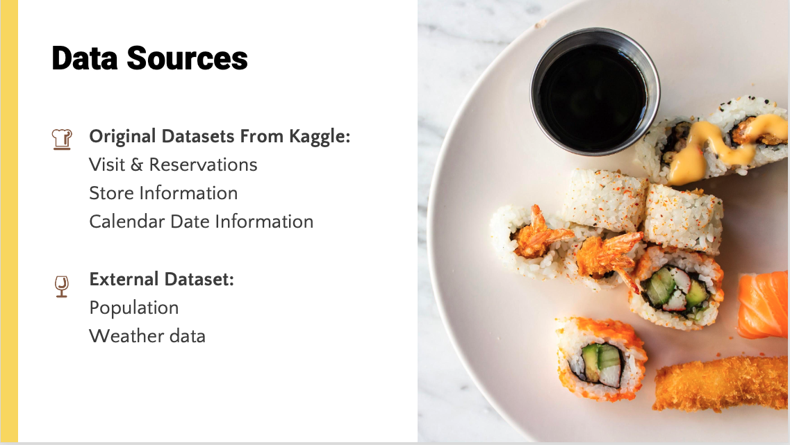
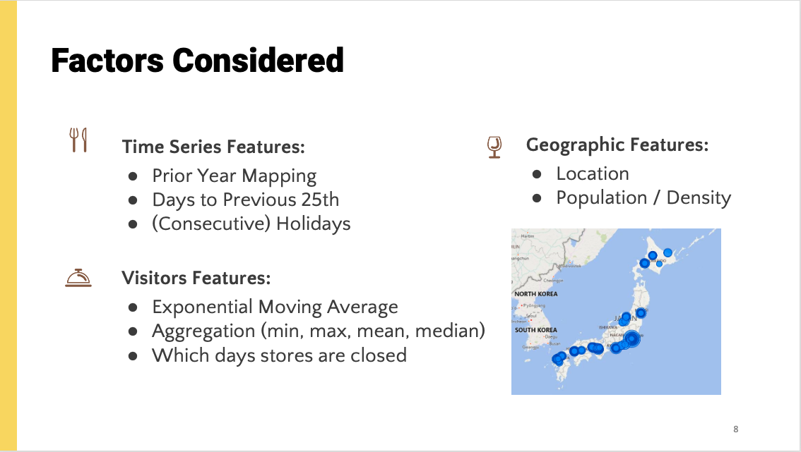
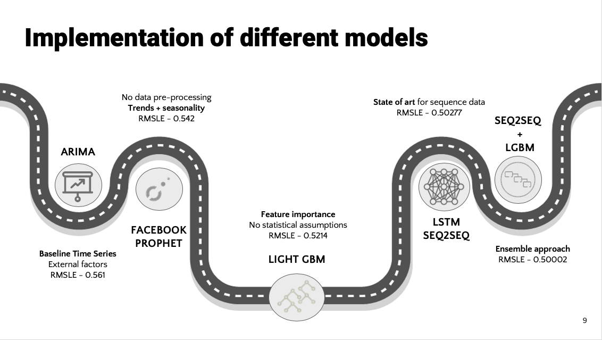

# recruit-restaurant-visitor-forecasting

Our team has Xuan Ji, Xue Ni, Samuel Musch, Yassine Manane and Olivia Liang. In Dec. 2019, we participated in the kaggle competition on our own and chose this topic as our final predictive project.

Here is the short description of this competition: 

Running a thriving local restaurant isn't always as charming as first impressions appear. There are often all sorts of unexpected troubles popping up that could hurt business.

One common predicament is that restaurants need to know how many customers to expect each day to effectively purchase ingredients and schedule staff members. This forecast isn't easy to make because many unpredictable factors affect restaurant attendance, like weather and local competition. It's even harder for newer restaurants with little historical data.

Recruit Holdings has unique access to key datasets that could make automated future customer prediction possible. Specifically, Recruit Holdings owns Hot Pepper Gourmet (a restaurant review service), AirREGI (a restaurant point of sales service), and Restaurant Board (reservation log management software).

In this competition, you're challenged to use reservation and visitation data to predict the total number of visitors to a restaurant for future dates. This information will help restaurants be much more efficient and allow them to focus on creating an enjoyable dining experience for their customers.

The process overview is like the below chart

------

# Data sources

# Factor Considered

# Models

